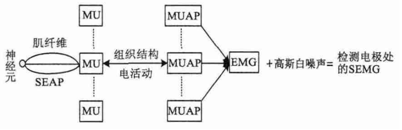

# Physical Training Helper Based on Electromyography and Acceleration-orientation Data

## Authors: Yanchen CHENG, Xiangwei MENG

## Abstract
With the development and progress of society, people are more and more inclined to exercise at home, or indoor sports. When you exercise alone or at home, you need an objective feedback to track your performance and point out if you exercise correctly. Among the devices that have helped us solve this problem are step counters, as well as heartbeat and blood pressure sensors. Now, one of the methods we have developed to analyze movement is EMG. It is through specific muscle EMG signal processing, intuitive analysis of your movement. EMG signal is produced by muscle contraction, which can be analyzed to get instructions to the computer. The technique is also used in prosthetics and rehabilitation.

EMG permits to estimate the level of muscle contraction and therefore provide such information as velocity and number of repetitions, level of fatigue, load distribution across muscles. When coupled with an inertial measurement unit data (accelerations and orientation), it can become powerful information source. The goal of this project is to implement a Python based program that allows users to control the mouse cursor by contracting the muscles of their hands. A software for collecting EMG signal from EMG arm band is designed by using Python language. Through the use of EMG and IMU acquisition equipment (myo arm band), python programming language and signal processing technology to achieve such a system prototype. We can start by counting the number of repetitions of hand exercises, such as push ups, and then do more complex analysis.

## Requirements
- **OS**: Operation System(s) the project can run on
- **Languages**: Programming languages used in the project
- **Dependancies**: packages, libraries, data required for the project but defined outside of it (examples: numpy, matplotlib, rosserial)
- Python 3
- myo-python
- numpy
- scipy
- matplotlib
- keyboard
- pyserial

## Introduction
### MYO
Myo this magic wristband detects the bioelectricity changes of the muscles on the arm when the user moves, and cooperates with the physical action monitoring of the arm to do human-computer interaction. With a wristband, you can control your mobile device like a Jedi. Myo set a specific action to start the device, just like Google glass's "OK, glass", and this action is not usually done by normal people. Myo uses Bluetooth 4.0 to connect to smart devices. Now it supports Mac OS and windows. In the future, it will launch APIs adapted to IOS and Android for developers to further invent all kinds of fun things. In 2013, Canadian startup Thalmic Labs launched an innovative armband MYO wristband (gesture control armband). This gesture control armband can be worn above the elbow joint of any arm to detect electrical activity generated by the user's muscles. It wirelessly connects with other electronic products through low-power Bluetooth devices to sense the user's actions.

 

 

With the development of detection technology and signal processing methods, it has become one of the hot issues in biomedical and medical circles to use sEMG instead of needle electrode EMG in the comprehensive clinical nondestructive diagnosis. The sEMG of human body is very weak and easy to be disturbed, and it is difficult to measure. How to collect and extract sEMG effectively has become one of the key technologies in SEMG application. According to the neurophysiological knowledge, muscle action potential will produce a potential difference of -90mv to 30mV, because the human body is the poor conductor of electricity (1m Ω The peak value of about 1mV can be obtained from the patch electrode of the body surface. According to the literature, the interference signals of very low frequency (close to DC) and high frequency are often mixed in sEMG, while the effective spectrum of EMG signals is distributed between 10-500hz. Therefore, the signal detected from the patch electrode needs to be processed by high pass filtering (straight processing), high magnification, low-pass filtering (filtering out high frequency interference) and other signal conditioning processes.

 

 

 

### Generating principle of EMG signal
The formation principle of physiological layer model: To better simulate the EMG model, we need to further understand the production process of EMG. The specific process can be described as follows: when the muscle is stimulated, an action potential (IAP) will be generated in the cell membrane, and the action potential will be generated at the neuromuscular junction and conduct along the muscle fiber to both sides of the muscle. In the process of conduction, single fiber action potential (SEAP) is produced on a single muscle fiber. The same motor unit is composed of many fibers, which is called motor unit (MU). After a series of electrical activities of tissue structure, it produces motor unit action potential (MUAP), which is filtered by a series of volume conductors such as muscle, fat and skin, final detection on skin surface.

 

MUAP waveform: Mu is composed of SEAP of all muscle fibers of the same motor unit superimposed on the skin surface. It contains a motor neuron and all the muscle fibers it innervates. Its range is a circular area in this paper, but the distribution of Mu spacing is not consistent. Motor units are always recruited in increasing order of α-motor neuron size. There is a positive correlation between the recruitment order of a single MU, peak amplitude and twitch tension, AKA "normal recruitment sequence" or "orderly recruitment". The recruitment and firing frequency (rate coding) of the motor unit mainly depends on the size of the force and the speed of contraction. The number of MU recruited and its average firing frequency determine the electrical activity in the muscle, that is, the same factors determine muscle strength. Therefore, a direct relationship between electromyography (EMG) and applied force can be expected. In human muscle, such as fiber type, these relationships are difficult to quantify, so it is difficult to build realistic models based on conditional probability model of parameters. Therefore, the simplest method is to make these parameters statistically independent. For the same mu, the waveform detected by the electrode moving step size of 10 mm each time is shown in Fig. 5. It can be determined from the figure that the muscle fiber which can affect the EMG signal detected by the surface electrode in practice should be very close to the detection electrode.

 

Before the simulation of motor unit action potential waveform, it is necessary to study the characteristics of motor unit recruitment and release. The motor unit of neuromuscular is closely related to the stimulation of muscle in the process of recruitment and release, and the control mode of motor unit is different for different muscle groups.
The surface EMG signal can be measured with wet electrodes and dry electrodes. Commonly used wet electrodes need to add conductive electrolyte gel or sponge between the electrode and the skin, but they can provide high-quality surface EMG signals. Wet electrodes usually require shaving or wiping treatment on the skin surface, which can reduce skin electrode impedance and movement artifacts. However, wet electrodes may not be suitable for long-term use at the surface EMG interface, because the drying of the conductive gel can cause irritation and cause skin discomfort, and potentially cause skin allergies and inflammation. However, modern dry electrodes do not require conductive gel and skin pretreatment, and can still achieve signal quality comparable to wet electrodes. Therefore, dry electrodes may be more suitable for surface EMG interfaces
When the muscle is stimulated, the Mu is activated when the input stimulation reaches its own recruitment threshold. According to the experimental statistics, the threshold RTE of Mu in biceps brachii obeys the exponential distribution, as shown in the formula.

 

### IMU signal acquisition system
1.IMU signal acquisition system takes arm and FPGA as the core, realizes high-precision time through GPS and high stability crystal, collects real-time data of 3-axis accelerometer and 3-axis gyroscope through high-precision AD conversion module, and finally outputs high-precision sensor data with time stamp, which lays a solid foundation for the realization of POS system. 
The main functions of IMU signal acquisition system are high-precision time acquisition and data acquisition of gyroscope and accelerometer. The system combines GPS, high stability quartz crystal, FPGA as the core, combined with effective algorithm to produce high-precision time (precision up to ±10uS). At the same time, the output signals of gyroscope (three-axis), accelerometer (three-axis) and other sensors are collected by FPGA and AD conversion module. The gyroscope and accelerometer are digitized and filtered. Finally, the data with time stamp and output of each sensor are quickly uploaded to the upper computer according to the set time interval for further processing.

2.Planning: The whole hardware system is composed of arm, FPGA, three-axis gyroscope, three-axis accelerometer, GPS and other sensor units, power management module, flash and SDRAM, and single board computer. FPGA mainly receives the digital signals of gyroscope and accelerometer after AD conversion, encoder and GPS signals to complete the output data acquisition of high-precision clock and sensor. Arm stores the data signal collected by FPGA and receives the high-precision time pulse output by FPGA. After stamping the sensor signal with high-precision time stamp, it quickly uploads it to the single board computer through USB or UART. The single board computer outputs the position, time and attitude information after a series of processing such as Kalman filter.

 
IMU is mostly used in motion control equipment, such as cars and robots. It is also used in the situation of precise displacement calculation with attitude, such as inertial navigation equipment of submarine, aircraft, missile and spacecraft. Therefore, in general, IMU should be installed on the center of gravity of the object to be measured.
